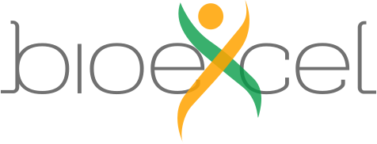

# BioExcel documentation space

## BioExcel Knowledge Centre

* [Training resources](https://krc.bioexcel.eu/training)
* [Competencies](https://krc.bioexcel.eu/competencies)

<!-- TODO: Integrate this page also into krc -->

## Best Practice Guides

These best practice guides have been developed by BioExcel:

* [HADDOCK best practice guide](https://www.bonvinlab.org/software/bpg/)
* [Packaging BioCompute Objects using RO-Crate](https://biocompute-objects.github.io/bco-ro-crate/)

These guides are under development:
* [Creating workflows with Common Workflow Language](/cwl-best-practice-guide)
* [How to choose which CWL workflow engine to deploy](/cwl-engine-guide/)
* [Primer on workflow packaging and metadata standards](https://docs.google.com/document/d/1XREgfYNi7l4HbdrnXBs7Uv1tMH2AiR435SKjisu4l30/edit#)
* QM/MM using GROMACS+CP2K
* GROMACS Best Practice Guide
* Alchemical free energy calculations based on non-equilibrium sampling

## Code documentation

The individual [codes](https://bioexcel.eu/software/) and tools developed by, contributed by and used by BioExcel have their own documentation spaces:

* [GROMACS documentation](http://manual.gromacs.org/)
* [GROMACS: Getting good performance from mdrun](http://manual.gromacs.org/current/user-guide/mdrun-performance.html)
* [HADDOCK 2.2 Manual](https://www.bonvinlab.org/software/haddock2.2/manual/)
* [HADDOCK 2.4 Manual](https://www.bonvinlab.org/software/haddock2.4/manual/)
* [PDB tools](https://www.bonvinlab.org/pdb-tools/)
* [PMX instructions](http://pmx.mpibpc.mpg.de/instructions.html)
* [CP2K Manuals](http://pmx.mpibpc.mpg.de/instructions.html)
* [CPMD documentation](https://www.cpmd.org/wordpress/index.php/documentation/)
* [CPMD manual (PDF)](https://www.cpmd.org/wordpress/CPMD/getFile.php?file=manual.pdf)
* [BioExcel Building Blocks (BioBB)](http://mmb.irbbarcelona.org/biobb/)
* [BioBB workflows](http://mmb.irbbarcelona.org/biobb/workflows)
* [Common Workflow Language user guide](https://www.commonwl.org/user_guide/)

## White-papers and related publications

These publications and white-papers by BioExcel authors include aspects of best-practice guidance:

* Recommendations for BioExcel Training Programme (2016) <https://doi.org/10.5281/zenodo.263926>
* Competency framework, mapping to current training & initial training plan (2016) <https://doi.org/doi:10.5281/zenodo.264231>
* I'll take that to go: Big data bags and minimal identifiers for exchange of large, complex datasets <https://doi.org/10.1109/BigData.2016.7840618> [preprint](https://www.research.manchester.ac.uk/portal/files/45989205/bagminid.pdf)
* Robust Cross-Platform Workflows: How Technical and Scientific Communities Collaborate to Develop, Test and Share Best Practices for Data Analysis (2017) <https://doi.org/10.1007/s41019-017-0050-4>
* Identifiers for the 21st century: How to design, provision, and reuse persistent identifiers to maximize utility and impact of life science data (2017) <https://doi.org/10.1371/journal.pbio.2001414>
* Sharing interoperable workflow provenance: A review of best practices and their practical application in CWLProv (2019): <https://doi.org/10.1093/gigascience/giz095>
* Whitepaper on Scientific Software Development (2018) <https://doi.org/10.5281/zenodo.1194634>
* Defining distance restraints in HADDOCK (2018) <https://doi.org/10.1038/s41596-018-0017-6>
* Enabling precision medicine via standard communication of HTS provenance, analysis, and results <https://doi.org/10.1371/journal.pbio.3000099>
* An enhanced-sampling MD-based protocol for molecular docking (2018): <https://doi.org/10.1101/434092> (see also <https://doi.org/1.1021/acs.jcim.8b00730>)
* The role of metadata in reproducible computational research (2020): <https://arxiv.org/abs/2006.08589>
* BioExcel Building Blocks, a software library for interoperable biomolecular simulation workflows <https://doi.org/10.1038/s41597-019-0177-4>

See also [BioExcel publications](https://bioexcel.eu/category/publications/) and the individual [software project pages](* <https://bioexcel.eu/software/>) for a complete list of publications.

## BioExcel website

* <https://bioexcel.eu/>
* <https://bioexcel.eu/software/>
* <https://bioexcel.eu/category/publications/>
* <https://bioexcel.eu/category/webinar/>
* <https://bioexcel.eu/services/training/>
* <https://krc.bioexcel.eu/>
* <https://ask.bioexcel.eu/>
